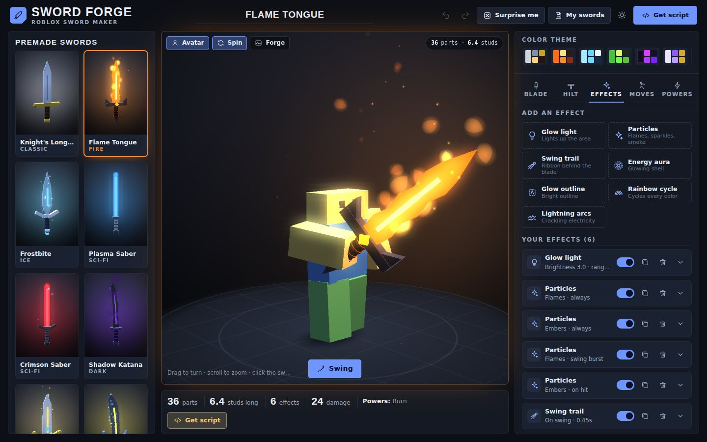
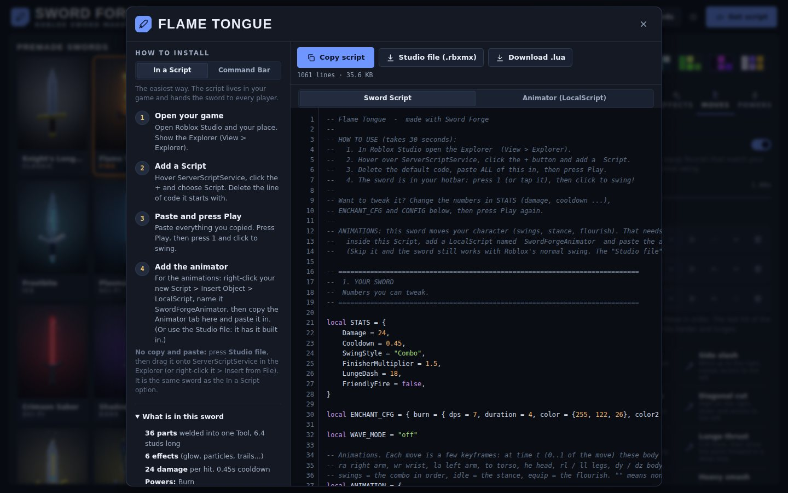
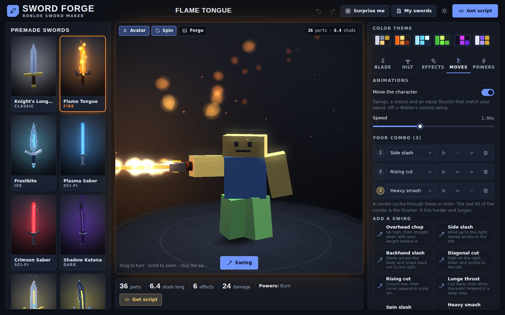

# Sword Forge

**Design a Roblox sword in your browser, then paste one script into Studio and swing it.**

Pick a premade sword or build your own, watch it swing in 3D, stack on effects, powers and **animations**, press **Get script**. No account, no uploads, no plugins: everything the sword needs (parts, particles, trails, sounds) comes with Roblox itself.



## Try it

| Way | How |
| --- | --- |
| Just open it | Double-click `index.html` (needs the whole folder), or `dist/sword-forge.html`, which is the same app in **one file** you can send to a friend. |
| Put it online | Repo **Settings > Pages > Deploy from a branch > main / (root)**. The site is plain static files, nothing to build. |
| From source | `npm install` then `npm run build` rebuilds the single file. |

It works offline. The only thing it fetches is the page font, and it falls back to system fonts without it.

## Put the sword in your game

Press **Get script**. There are two ways to install it. Both give you the same sword.



**1. In a Script (easiest)**

1. In Studio open the Explorer (View > Explorer).
2. Hover **ServerScriptService**, click **+**, add a **Script**.
3. Delete the line of code it starts with, paste the whole script.
4. Press **Play**. The sword is in your hotbar: press `1` and click to swing.

The script builds the sword and gives a fresh copy to every player each time they spawn.

**Or skip copy and paste:** press **Studio file** in the same dialog. You get a `.rbxmx` model file (a `.zip` containing it, when you use the in-Claude Artifact). Drag the file onto **ServerScriptService** in the Explorer, or right-click it > **Insert from File...**, then press Play. It is the same sword as option 1.

**2. Command Bar (builds a real Tool you can edit)**

1. In Studio choose View > Command Bar.
2. Paste the whole script and press **Enter**.
3. The sword appears in **StarterPack** as a normal Tool with its own Script. Open it up, move parts around, save it to your Toolbox.

### Animations (swings, stance, flourish)



Every premade sword comes with moves that suit it (a katana crouches into a draw cut, a greatsword smashes, a saber twirls). They are made of keyframes that turn the character's arms, wrist, torso, head and legs, so they work on **R6 and R15** bodies and replicate to everyone.

How it works: the sword Script only says "this move started now" (a Tool attribute). A small **LocalScript called `SwordForgeAnimator`** runs on every player's machine, reads that, and turns the character's joints (`Motor6D.C0`) and the sword's grip every frame, which is why it is smooth.

* **Studio file:** has the animator built in. Nothing to do.
* **Command Bar:** the builder also puts `SwordForgeAnimator` into StarterPlayerScripts.
* **In a Script (copy and paste):** add a `LocalScript` named `SwordForgeAnimator` *inside* your Script and paste the **Animator** tab into it. Without it, the sword still works and uses Roblox's normal swing (the Output window says so once).

In the **Moves** tab you choose the combo (add, remove, reorder swings, preview each one), a **stance** while holding the sword, an **equip flourish** and the speed. Each hit of the combo plays the next move; the last one is the finisher. The moves are plain keyframe data in the `ANIMATION` table at the top of the script, so you can also edit them by hand.

### What is in the Tool

```
Tool "Your Sword"
├── Handle            invisible grip point; every other part is welded to it
├── Blade, Guard, Grip, Pommel ...   the visible Parts (blocks, wedges, cylinders, balls)
├── Hitbox            invisible box that follows the blade and decides what a swing hits
├── TrailBase / TrailTip / TipPoint / HiltPoint     Attachments for effects
├── SwingTrail, SwordGlow, particle emitters, Beams ...   your effects
├── SwingSound, LungeSound, EquipSound    Roblox's own sword sounds
└── Script            (command-bar mode only) the combat code
```

### How it plays

* **Click to swing.** The default is a **3-hit combo**: two slashes, then a stronger lunge with a short dash. You can also pick slash-only or lunge-only.
* **Swings hit once per target**, ignore the wielder, respect ForceFields, and skip teammates unless you allow friendly fire. Kills are credited with the usual `creator` tag.
* The character plays Roblox's standard slash / lunge tool animations.

## What you can make

* **14 premade swords**: classic steel, flame, frost, two lightsabers, shadow katana, holy greatsword, storm saber, venom, vampire, rainbow, heavy greatsword, void, dagger.
* **13 blade styles** (longsword, broad, leaf, katana, scimitar, rapier, flamberge, greatsword, cleaver, dagger, crystal, serrated, energy blade) with sliders for length, width, thickness, tip, curve, taper, saw teeth and a groove or glowing inlay.
* **7 guards, 5 pommels, wrapped grips, gems**, materials and colors for every part, plus 12 one-click **color themes**.
* **Effect layers** you can stack and switch on or off:
  glow light, particles (12 looks: flames, embers, sparkles, holy light, frost, electric sparks, soul wisps, smoke, void mist, toxic fumes, crimson mist, rainbow stars; each can run always, while swinging, as a burst, on hit or on equip), swing trail, energy aura, glow outline, rainbow color cycle, lightning arcs.
* **Animations**: 13 swings (overhead chop, side and backhand slashes, diagonal and rising cuts, lunge thrust, spin, heavy smash, cross slash, flurry, draw cut, whirlwind, quick slash), 6 stances, 4 equip flourishes. Build your own combo.
* **Enchantments**: burn, poison, freeze, shock stun, life steal, knockback, lightning strike, explosive hits.
* **Sword wave**: a glowing slash that flies forward on every swing or on the 3rd combo hit.
* **Quality of life**: live 3D preview with an avatar and swing animation, undo / redo, **Surprise me** randomizer, a library for saved swords, copy and paste sword codes (and share links when you host it).

## Tweak it after the fact

The top of the script is meant to be edited:

```lua
local STATS = {
	Damage = 24,
	Cooldown = 0.45,
	SwingStyle = "Combo",     -- "Combo", "Slash" or "Lunge"
	FinisherMultiplier = 1.5,
	LungeDash = 18,
	FriendlyFire = false,
}
local ENCHANT_CFG = { burn = { dps = 7, duration = 4, ... } }
local CONFIG = { ... }        -- every part and effect, as plain data
```

Stats also become **Attributes** on the Tool, so in command-bar mode you can change `Damage` in the Properties window while testing.

## Troubleshooting

* **Nothing happens when I click.** It has to be a `Script` (not a LocalScript) in ServerScriptService, and you have to press Play. Check the Output window for red text.
* **The pointed tip or edges look inside-out in Studio.** Open Get script > *Something is not working?* and switch on **Flip wedge direction**, then copy the script again. (See "Known limits" below.)
* **No particles.** They use Roblox's built-in `sparkles_main`, `smoke_main` and `fire_main` textures. If a texture is ever missing in a Roblox version, that effect is invisible; the rest still works.
* **Too many glow outlines.** Roblox draws at most 31 Highlights at once.
* **Sword is held at a strange angle.** Use *Hilt > Tilt forward*, or *Blade > Whole sword scale* if it is too big or small.

## How it works

```
config (plain JSON)
   │  normalize()           js/data.js      clamps and fills in everything, never throws
   ▼
buildModel()                js/model.js     turns it into a list of Roblox Parts + resolved effects
   ├──► 3D preview          js/gl.js, js/preview.js     WebGL renderer, avatar, particles, trail, bloom
   └──► generate()          js/luau.js + js/engine.js   writes the Luau script
```

The preview and the script are built from the **same parts list**, so what you see is what Studio builds. Roblox conventions are respected in one place (`js/model.js`): `WedgePart` triangle orientation, cylinders along X, `CFrame.Angles` rotation order, and a Tool held blade-up with the edge forward.

The generated script is data plus a small engine: `CONFIG` describes the parts and effects, `buildSword()` makes the Tool, `setupCombat(tool)` does the fighting. Only the engine blocks a sword actually uses are included, so a plain sword stays short.

### Files

| Path | What it is |
| --- | --- |
| `index.html`, `css/style.css` | the app shell and styles |
| `js/data.js` | options, schemas for effects and enchantments, defaults, `normalize()` |
| `js/anims.js` | the move library (keyframes) and the pose math shared by the preview and the animator |
| `js/model.js` | blade / guard / grip / pommel geometry and effect resolution |
| `js/engine.js` | the Luau code blocks that end up in every script |
| `js/luau.js` | assembles and serializes the final script (two install modes) |
| `js/export.js` | the Studio file (`.rbxmx`) and a tiny zip writer |
| `js/presets.js` | the premade swords |
| `js/gl.js`, `js/preview.js` | the WebGL renderer and the preview scene |
| `js/icons.js`, `js/app.js` | icons and the user interface |
| `dist/sword-forge.html` | everything bundled into one file (`npm run build`) |
| `tests/`, `tools/` | tests, build and screenshot scripts |

### Adding things

* **A blade style**: add an entry to `SF.BLADE_STYLES` in `js/data.js` (a width profile plus defaults). It appears in the picker automatically.
* **A particle look**: add it to `SF.PARTICLE_STYLES`. The preview and the script both read it.
* **A move**: add a `def('my_move', 'swing', 'Name', 'Blurb', { dur: 0.7, hit: [0.3, 0.5] }, [k(0), k(0.3, { ra: [100, -20, 0] }), ..., k(1, REST)])` to `js/anims.js`. `ra` is the right arm, `wr` the wrist, `la` the left arm, `to` the torso, `he` the head, `rl` / `ll` the legs (degrees); `hit` is when the blade is live. It shows up in the Moves tab, the preview and the script.
* **An effect kind or enchantment**: describe its settings in `SF.FX_KINDS` / `SF.ENCHANTS` (the UI is generated from that), add a builder in `js/engine.js`, and teach the preview in `js/preview.js` if it has a visual.

## Development

```bash
npm install
npm test          # lints + runs every generated script in a real Luau VM (30,000+ checks)
npm run test:ui   # drives the real page in headless Chromium (needs: npx playwright install chromium)
npm run build     # rebuilds dist/sword-forge.html
```

**How the script is tested.** Roblox Studio cannot run in CI, so `tests/` does the next best thing:

1. Every script is linted with the real Luau analyzer (`@luau-rs/luau`).
2. It is then *executed* in a real Luau VM against `tests/mock.luau`, a strict mock of the Roblox API. The mock throws on unknown properties, methods and enum items and on wrongly typed values, so a typo fails the test instead of failing in Studio.
3. `tests/scenario.luau` plays a small fight: spawn, get the sword, equip, swing a 3-hit combo, check damage, burn / poison / freeze / stun / life steal / knockback / lightning / explosion, the lunge pose, the sword wave, effects switching on and off, unequip, no leaked parts.
4. For animated swords it also runs the **animator** itself against R6 and R15 rigs with real `Motor6D` joints and checks, move by move, that every joint ends up exactly where the JavaScript pose math says (the same math the preview draws), and that putting the sword away restores the body.
5. That runs for every premade sword, every blade, guard and pommel, a kitchen-sink sword, extreme scales, hostile input, and 80 randomized swords, in both install modes.

## Known limits

* **It has never been run inside Roblox Studio.** The mock encodes the Roblox API as documented and as remembered, so an unusual Roblox behavior could still surprise it. The riskiest assumption is the exact orientation of `WedgePart`; that is why the **Flip wedge direction** switch exists. If you hit a problem, the Output window message names the exact property, because each effect is built inside `pcall` and one bad property is skipped instead of breaking the sword.
* **The animations have not been seen in Studio either.** The joint math is checked against the preview and the rig layouts are the standard R6 / R15 ones, but how a pose *looks* on a real character (and the exact `RightGrip` weld behaviour) is unconfirmed. If an arm bends the wrong way, tell me which move and I will fix the keyframes; you can also turn animations off in the Moves tab.
* The preview is an approximation of Roblox's renderer (materials, particles and Neon glow look similar, not identical).
* Waves, lightning and knockback are server-side and simple on purpose, so they work without any extra setup. They do not replace a full combat framework.
* Particles and the Highlight effect cost frame time on very low-end devices; keep effects under about 8.
